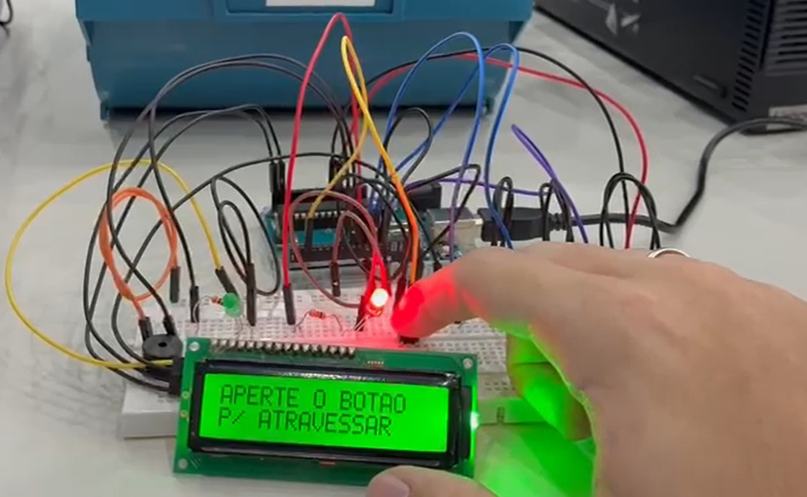
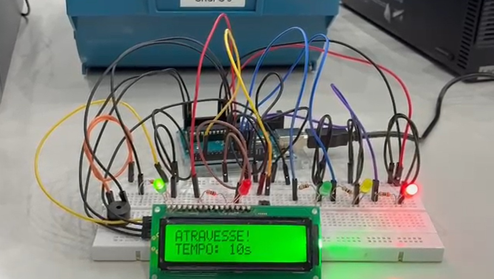
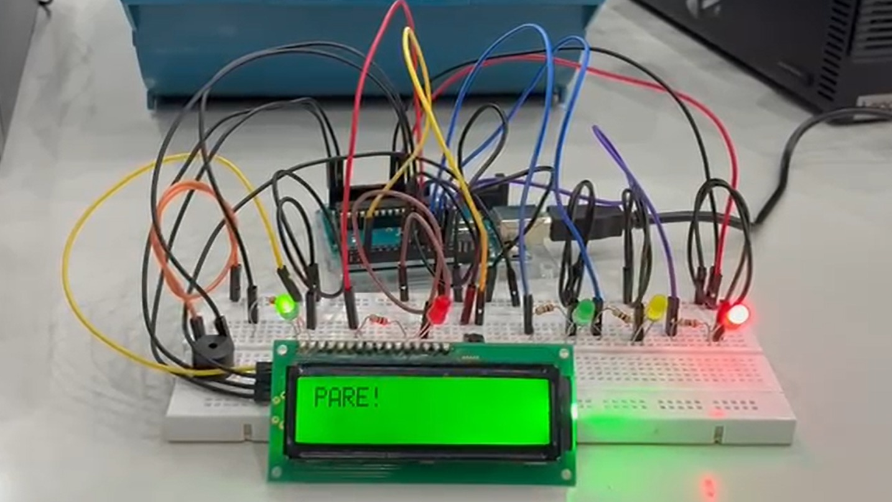

# 🚦 Sistema de semáforos inteligente com LCD e som

Projeto desenvolvido em **Arduino** que simula um **semáforo inteligente para travessia de pedestres**, utilizando botão de acionamento, display LCD I2C para instruções e um buzzer que reproduz a **Marcha Imperial de Star Wars** durante o tempo de travessia.

O sistema permite que o pedestre solicite a travessia pressionando um botão. O semáforo então executa a sequência de sinalização para veículos e pedestres, exibindo mensagens no LCD e emitindo sinais sonoros para auxiliar na travessia.

---

# 📌 Funcionalidades

* 🚗 Controle de semáforo para **veículos** (verde, amarelo e vermelho)
* 🚶 Controle de semáforo para **pedestres** (verde e vermelho)
* 🔘 **Botão para solicitar travessia**
* 📟 **Display LCD 16x2 com interface I2C**
* 🔊 **Buzzer tocando a Marcha Imperial (Star Wars)**
* ⏳ **Contagem regressiva de travessia (15 segundos)**
* ⚠️ **Alerta visual e sonoro ao final da travessia**

---

# ⚙️ Componentes Utilizados

* Arduino Uno (ou compatível)
* Display **LCD 16x2 com módulo I2C**
* 3 LEDs para semáforo de veículos

  * Vermelho
  * Amarelo
  * Verde
* 2 LEDs para pedestres

  * Vermelho
  * Verde
* Botão (Push Button)
* Buzzer
* Resistores
* Protoboard
* Jumpers

---

# 🔌 Mapeamento de Pinos

| Componente            | Pino Arduino |
| --------------------- | ------------ |
| LED Carro Vermelho    | 12           |
| LED Carro Amarelo     | 11           |
| LED Carro Verde       | 10           |
| LED Pedestre Vermelho | 9            |
| LED Pedestre Verde    | 8            |
| Buzzer                | 7            |
| Botão                 | 2            |
| LCD I2C               | SDA / SCL    |

Endereço I2C do LCD utilizado:

```
0x27
```

---

# 🔄 Funcionamento do Sistema

### 1️⃣ Estado Inicial

* 🚗 **Carros:** Verde
* 🚶 **Pedestres:** Vermelho

Mensagem exibida no LCD:

```
APERTE O BOTAO
P/ ATRAVESSAR
```

---

### 2️⃣ Solicitação de Travessia

Quando o pedestre pressiona o botão:

1. O semáforo dos carros muda de **verde → amarelo**
2. Em seguida muda para **vermelho**
3. O semáforo de pedestres muda para **verde**

O LCD mostra:

```
AGUARDE...
```

---

### 3️⃣ Travessia

Durante **15 segundos**:

* O LCD exibe **contagem regressiva**
* O buzzer toca a **Marcha Imperial de Star Wars**
* O pedestre pode atravessar com segurança

Exemplo no display:

```
ATRAVESSE!
TEMPO: 10s
```

---

### 4️⃣ Fase de Alerta

Quando o tempo termina:

* O LCD exibe **PARE**
* O LED verde do pedestre **pisca**
* O buzzer emite **alerta sonoro**

---

### 5️⃣ Reinício do Sistema

Após o alerta:

* Pedestres: **vermelho**
* Carros: **verde**
* O sistema volta ao estado inicial aguardando nova solicitação.

---

# 🎵 Sistema Sonoro

Durante a travessia o buzzer executa a **Marcha Imperial**, trilha famosa da franquia **Star Wars**.

A música é tocada progressivamente enquanto a contagem regressiva ocorre.

---

# 🖥️ Tecnologias Utilizadas

* **Arduino (C/C++)**
* Biblioteca **Wire**
* Biblioteca **LiquidCrystal_I2C**

---

# 📷 Imagens reais do projeto
<p align="center">
  
  
  
</p>

### Link do projeto no TinkerCad

[Aperte aqui para visualizar o projeto no Tinkercad](https://www.tinkercad.com/things/hsZpGRncGyy-semaforo-inteligente?sharecode=WR0LkLC7LonnQze1UXTy1woObO8IlZYylO7u8591N5M)

---

# 👨‍💻 Desenvolvedores

Projeto desenvolvido por:

* **Denis Borges Ribeiro**
* **Enzo Vinturini Pavesi**
* **Gustavo Montemor**
* **Juan Fernando Lima Caceres**
* **Pedro Febba Abrahão**

---

# 📄 Licença

Projeto desenvolvido para **fins educacionais e acadêmicos**.
